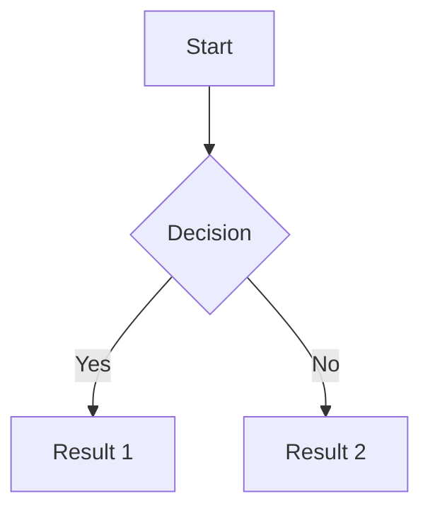

## What it is

Markdown mode is K-Perception's second editor mode. It pairs a CodeMirror 6 source pane with a custom rendering pipeline that produces a live HTML preview. The source format is GitHub Flavored Markdown (GFM) with a set of extensions: KaTeX inline and display math, Mermaid diagram fences, footnotes, strikethrough, subscript, superscript, a table-of-contents directive, and syntax-highlighted code fences via highlight.js.

The editor has a dual-pane layout on desktop and web: you write Markdown on the left and see the rendered result on the right, scrolling in sync. On mobile, a toggle switches between source and rendered views. A dedicated Zen mode strips away the chrome and gives you a single centred writing column.

Markdown mode is the most feature-rich of the text-source editors. It is designed for writers who are comfortable with Markdown syntax and want a highly capable, portable format that does not lock content into a proprietary schema.

## When to use it

Use Markdown mode when:

- You are writing structured documents where the source format matters: documentation, README files, blog posts, study notes, technical articles.
- You want KaTeX math rendering without a full LaTeX document setup.
- You need Mermaid diagrams embedded directly in prose.
- You plan to copy or export the source Markdown to another tool (GitHub, Obsidian, a static site generator).
- You want reading time estimation and an auto-generated table of contents.
- You are writing on a project that requires footnote citations (academic summaries, annotated bibliographies).

If you need a full academic paper with numbered equations, section numbering, and a bibliography, use Editorial mode or LaTeX mode instead. If you do not want to write markup at all, use Docs mode.

## Step by step

### GFM syntax reference

**Headings**

```
# Heading 1
## Heading 2
### Heading 3
#### Heading 4
##### Heading 5
###### Heading 6
```

**Inline formatting**

```
**bold**   *italic*   ~~strikethrough~~   `inline code`
H~2~O (subscript)   E=mc^2^ (superscript)
```

**Links and images**

```
[link text](https://example.com "optional title")

```

Images can also be added by drag-and-drop or paste (see below).

**Code fences**

Specify the language immediately after the opening fence for syntax highlighting:

````
```python
def hello():
    print("Hello, world!")
```
````

highlight.js supports over 180 languages. If the language tag is omitted, the block is rendered as unstyled code.

**Tables**

```
| Column A | Column B | Column C |
|----------|----------|----------|
| value    | value    | value    |
```

Alignment is specified with colons:

```
| Left   | Centre  | Right   |
|:-------|:-------:|--------:|
| text   | text    | text    |
```

**Task lists (GFM checkboxes)**

```
- [x] Completed task
- [ ] Incomplete task
```

**Blockquotes**

```
> This is a blockquote.
> It can span multiple lines.
```

**Horizontal rule**

```
---
```

### KaTeX math

Write inline math between single dollar signs: `$E = mc^2$`

Write display (block) math between double dollar signs:

```
$$
\int_{-\infty}^{\infty} e^{-x^2} dx = \sqrt{\pi}
$$
```

K-Perception uses KaTeX, so the full KaTeX function set is available. The LaTeX.js-specific packages used in LaTeX mode are not available here; for full document-class LaTeX, switch to LaTeX mode.

### Mermaid diagrams

Wrap any Mermaid diagram definition in a fenced code block tagged `mermaid`:

````

````

Supported diagram types include flowcharts, sequence diagrams, class diagrams, Gantt charts, pie charts, and state diagrams. The preview pane renders the diagram as an SVG.

### Footnotes

Define a footnote reference anywhere in the text:

```
This claim needs a source.[^1]

[^1]: Author, "Title", Year. https://example.com
```

Footnotes are automatically numbered and rendered as a section at the bottom of the preview. The inline reference renders as a superscript link.

### Table of contents

Insert the `[TOC]` directive on its own line to auto-generate a table of contents based on the document's headings:

```
[TOC]

## Section one

Content here.

## Section two

More content.
```

The TOC is rendered in the preview at the location of the directive. It is nested according to heading level.

### Split-pane preview

Click the **Split pane** icon in the toolbar (or press **Ctrl/Cmd+Shift+P**) to toggle the split-pane view. The source pane is on the left; the rendered preview is on the right. Scrolling in either pane synchronises the other.

To change the split ratio, drag the divider between the two panes.

### Zen mode

Press **Ctrl/Cmd+Shift+Z** to enter Zen mode. The sidebar, toolbar, and status bar disappear. You write in a single centred column. Press **Escape** or the same shortcut to exit.

### Reading time

The status bar displays an estimated reading time based on the word count of the rendered preview (excluding code blocks). The estimate uses a baseline of 200 words per minute.

### Drag-and-drop images

Drag an image file from your desktop and drop it onto the editor. K-Perception encrypts the image, stores it as an attachment on the note, and inserts the appropriate Markdown image reference into the source. Pasting an image from the clipboard (Ctrl/Cmd+V while a file is in the clipboard) works the same way.

### Smart Enter and Tab

**Smart Enter**: if your cursor is at the end of a list item (unordered `-`, ordered `1.`, or task `- [ ]`), pressing Enter creates the next list item at the same indentation level. Pressing Enter on an empty list item exits the list.

**Smart Tab**: with the cursor inside a list item, pressing Tab indents the item one level deeper. Shift+Tab dedents it.

### Find & Replace

Press **Ctrl/Cmd+F** to open Find. Press **Ctrl/Cmd+H** to open Find & Replace. Both support regex mode (click the `.*` toggle). See the Find & Replace section in the plain text article for a full walkthrough; behaviour is identical in Markdown mode.

## Behaviour and edge cases

- **Scroll sync**: scroll sync between the source and preview panes is approximate. It uses a heading-position heuristic rather than character-level mapping. In long documents with dense text and few headings, the sync may drift by a few lines.
- **Mermaid errors**: if a Mermaid block contains a syntax error, the preview shows an inline error message with the failing line. The rest of the document renders normally.
- **KaTeX errors**: a KaTeX parse error shows the raw LaTeX source highlighted in red inline. Other math in the document is unaffected.
- **Image attachments from Markdown source**: the image reference generated by drag-and-drop uses a relative `attachment://` URI scheme that resolves within K-Perception. If you export the raw Markdown source and open it in another editor, these references will be broken. Use the HTML or PDF export formats if you need images to travel with the document.
- **Very large documents**: the preview re-renders on every keystroke with a debounce of 150 ms. Documents above approximately 50,000 words may produce noticeable preview lag. If this is an issue, disable the live preview and use the manual refresh button.
- **[TOC] placement**: if you place `[TOC]` inside a code fence, it is treated as literal text and not expanded.
- **Nested blockquotes**: deeply nested blockquotes (4+ levels) render correctly but may produce narrow text columns. K-Perception does not impose a nesting limit.
- **Footnote ordering**: footnotes are numbered in the order they first appear in the source, not in the order they are defined. Definitions can be placed anywhere in the document.

## Platform differences

| Feature | Windows (Electron 28) | Android (Capacitor 6) | Web (PWA) |
|---|---|---|---|
| Source + preview split pane | Yes | No (tab toggle) | Yes |
| Zen mode | Yes | No | Yes |
| Drag-and-drop images | Yes | No (use media picker) | Yes |
| Clipboard image paste | Yes | Depends on Android version | Yes |
| Find & Replace with regex | Yes | Basic only | Yes |
| Reading time | Yes | Yes | Yes |
| Mermaid rendering | Yes | Yes | Yes |
| KaTeX rendering | Yes | Yes | Yes |
| Scroll sync | Yes | N/A | Yes |
| Export to PDF | Yes | Via share / export screen | Yes |
| Syntax highlighting in fences | Yes | Yes | Yes |

## Plan availability

Markdown mode is available on all plans. All syntax features, including KaTeX, Mermaid, footnotes, and the split-pane preview, are available on every plan including the free Local tier.

Plan-based limits that apply to cloud features (not to the editor itself):
- **Local (free)**: no cloud sync; no revision history.
- **Guardian**: cloud sync; 30-day revision history.
- **Vault / Lifetime / Team / Enterprise**: cloud sync; unlimited revision history; larger attachment upload quota.

## Permissions and roles

- **Owner / Admin / Editor**: full read/write access including export.
- **Viewer / Guest**: can read the rendered preview; cannot edit the source; can use Find in read-only mode.

In workspace channels, Markdown-mode notes follow the channel's ACL. The note's mode cannot be changed by a Viewer or Guest.

## Security implications

Markdown rendering happens client-side. The preview pane uses a sandboxed iframe or a carefully scoped DOM attachment depending on the platform. HTML sanitisation is applied to the rendered output before it is inserted into the DOM to prevent XSS via embedded raw HTML.

If you enable raw HTML passthrough in the settings (disabled by default), arbitrary HTML tags in the Markdown source will be rendered in the preview. This does not represent a server-side risk, but any JavaScript you write in a `<script>` tag in a raw-HTML note will execute in the context of the K-Perception renderer process. Enable this setting only if you understand the implication and are working with notes that you produced yourself.

Mermaid diagrams are rendered using the official Mermaid.js library in the same sandboxed context.

KaTeX rendering is pure computation; it does not make network requests.

Images stored via drag-and-drop are encrypted before storage. The `attachment://` URIs are resolved entirely in-process.

## Settings reference

| Setting | Location | Description |
|---|---|---|
| Live preview | Settings → Editor → Markdown → Live preview | Enable real-time preview re-render on every keystroke. Default: on. |
| Preview debounce (ms) | Settings → Editor → Markdown → Preview debounce | Delay before preview re-renders after typing stops. Default: 150 ms. |
| Scroll sync | Settings → Editor → Markdown → Scroll sync | Synchronise scroll position between source and preview. Default: on. |
| Default layout | Settings → Editor → Markdown → Default layout | Split pane, source only, or preview only. Default: split pane (desktop). |
| Raw HTML passthrough | Settings → Editor → Markdown → Raw HTML | Allow HTML tags in Markdown source to render in preview. Default: off. |
| Smart Enter | Settings → Editor → Markdown → Smart Enter | Auto-continue lists on Enter. Default: on. |
| Smart Tab | Settings → Editor → Markdown → Smart Tab | Indent/dedent list items with Tab. Default: on. |
| Reading time baseline | Settings → Editor → Reading time | Words per minute used for the reading time estimate. Default: 200. |
| Mermaid theme | Settings → Editor → Markdown → Mermaid theme | Light or dark diagram theme. Follows app theme by default. |

## Related articles

- [Editor modes overview](overview.md)
- [LaTeX editor](latex.md)
- [Plain text editor](plain-text.md)
- [Keyboard shortcuts](keyboard-shortcuts.md)
- [Exports](exports.md)
- [Revision history](revision-history.md)
- [Attachments](attachments.md)

## Source references

- `src/shared/types.ts` line 23 — `NoteMode` type includes `"markdown"`
- `src/renderer/src/components/` — `MarkdownEditor` and `MarkdownPreview` components
- `mobile/src/` — `MobileMarkdownEditor` with tab-toggle preview
