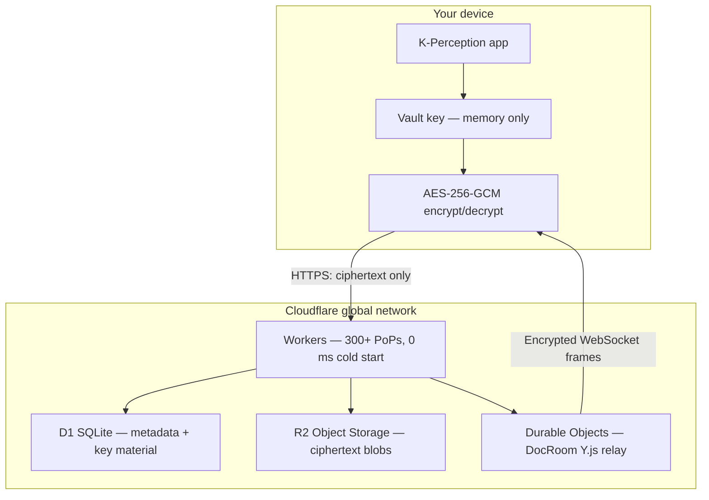

# What is K-Perception?

## What it is

K-Perception is a zero-knowledge, end-to-end encrypted personal knowledge management system. It lets you write, organise, and share information across seven specialised editor modes — plain text, Markdown, LaTeX, rich-text documents, spreadsheets, freehand canvas, and editorial composition — without the server ever seeing your content in readable form.

The product ships in three runtimes:

- **Desktop** — a native Electron 28 application for Windows and macOS
- **Android** — a native app built on Capacitor 6 with Vite and React 18
- **Web** — a progressive web app that runs in any modern browser, installable to your home screen

All three runtimes share the same cryptographic core and sync against the same Cloudflare Workers backend. A note you create on your desktop appears on your phone as ciphertext in transit and ciphertext at rest; decryption happens exclusively on your device.

## When to use it

K-Perception is the right tool when at least one of the following is true:

- You store sensitive information — medical notes, legal drafts, personal journal entries, research in progress — and want a legally enforceable guarantee that the service provider cannot read it.
- You write in multiple formats and dislike switching apps (a technical spec in Markdown, a budget in Sheets, a diagram in Canvas, all in one place).
- You work on a team or in a regulated organisation that requires audit logs, SSO, SCIM provisioning, and HIPAA Business Associate Agreements.
- You want to pay once and own your data forever, with no vendor lock-in — the Local plan requires no subscription and no network connection.

It is not the right tool if you need real-time team wikis with in-line commenting visible to an administrator, or if your primary use case is project management with assignable tasks (though you can build a reasonable approximation with Sheets and the Editorial editor).

## Step by step

Getting started takes under five minutes:

1. Choose your platform and follow the relevant install guide (see Related articles).
2. Launch the app. On first run, the vault setup wizard appears.
3. Create an account (optional for the Local plan) or skip to local-only mode.
4. Pick a strong vault password. The app derives your master vault key from this password using Argon2id (m=19 MiB, t=2, p=1) with a random 16-byte salt. The key never leaves your device.
5. Create your first note. Choose an editor mode from the note header.
6. If you are on a paid plan, enable cloud sync in Settings → Sync. The app encrypts every note with AES-256-GCM before sending it.

## Behaviour and edge cases

- If you forget your vault password, you cannot recover your notes without your recovery code. The server cannot help you; it holds only ciphertext.
- Changing your vault password re-encrypts all local keys using the new password but does not invalidate notes already on other devices until they next sync.
- The seven editors are not separate applications; they share the same note container. You can switch a note's mode at any time, though switching away from Sheets will render the note as raw cell data in other modes.
- Offline edits are queued and synced when a connection is available. Conflicts are resolved using Y.js CRDT semantics (last-write-wins at the operation level, not at the document level).

## Platform differences

| Feature | Windows | Android | Web |
|---|---|---|---|
| Native file-system access | Yes (Electron FS) | Via Android SAF | No (IndexedDB only) |
| Biometric unlock | No | Yes (fingerprint / face) | No |
| Background sync | Yes (tray agent) | 30-second pull polling | Tab must be open |
| Quick-capture widget | No | Yes | No |
| Command palette | Cmd+K / Ctrl+K | Long-press toolbar | Ctrl+K |
| PDF export | Yes | Yes | Yes (print dialog) |
| 3-pane shell | Yes | Single pane + drawer | Responsive 2-pane |
| IPC CORS bypass | Yes (main-process net.fetch) | N/A | N/A |

## Plan availability

All plans unlock all seven editor modes. Plan differences are about device count, storage, collaboration, and compliance features. See [Choosing a plan](choosing-a-plan.md) for a complete breakdown.

| Plan | Price | Storage | Devices |
|---|---|---|---|
| Local | Free forever | 0 GB cloud | 1 |
| Guardian | €3.49/mo or €29/yr | 5 GB | 3 |
| Vault | €7.99/mo or €67/yr | 50 GB | 8 |
| Lifetime | €149 one-time | 50 GB | 8 |
| Team | €6.99/user/mo | 100 GB shared | Unlimited |
| Enterprise | €14.99/user/mo | Unlimited | Unlimited |

## Permissions and roles

In personal accounts, there is one implicit role: owner. In workspaces (Team and Enterprise plans), roles are: owner, admin, editor, commenter, viewer, and guest. Role definitions are covered in the Workspace documentation.

## Security implications

### The zero-knowledge guarantee — not marketing, but mathematics

Zero-knowledge encryption means the service operator is mathematically incapable of reading your plaintext data, not merely contractually prohibited from doing so.

Here is the chain of reasoning:

1. Your vault password is the root secret. It is typed on your device and never transmitted.
2. Argon2id(password, salt, m=19456 KiB, t=2, p=1) → 256-bit master vault key (MVK). The MVK is held in device memory only for the duration of the session.
3. Every note is encrypted with AES-256-GCM using a per-note derived key. The ciphertext and a random 12-byte nonce are what get stored in R2 and sent over the wire. The key is never stored anywhere unencrypted.
4. The Cloudflare Worker receives only ciphertext blobs identified by opaque IDs. It performs routing, access control, and relay functions. It cannot distinguish a note about your medical history from a note about your grocery list.
5. The D1 database stores encrypted blobs, metadata (note ID, owner ID, size, updated-at timestamp), and workspace key material encrypted under the workspace data key. No plaintext ever touches D1.

An adversary who compromises the entire Cloudflare infrastructure — the Worker code, the D1 database, the R2 bucket — obtains ciphertext that requires breaking AES-256-GCM to read. The current best public attack against AES-256-GCM with fresh random nonces requires more computation than exists on Earth.

The one thing this guarantee cannot protect against is a weak vault password. A password such as "password1" is not protected by strong encryption; it is defeated by a dictionary attack on the Argon2id output. Choose a passphrase of at least four unrelated words or use a password manager to generate a 20-character random string.

### System architecture

The Worker never touches plaintext. The DocRoom Durable Object acts as a blind relay for Y.js update messages; each message is an AES-256-GCM ciphertext before it leaves the originating device.

## Settings reference

| Setting | Location | Description |
|---|---|---|
| Vault password | Settings → Security → Change password | Re-derives MVK and re-encrypts all local key material |
| Auto-lock timeout | Settings → Security → Auto-lock | Locks vault after N minutes of inactivity |
| Sync enabled | Settings → Sync | Toggles cloud sync on/off; local notes are not deleted if sync is disabled |
| Editor default mode | Settings → Editor → Default mode | New notes open in this mode |
| Theme | Settings → Appearance | Light, dark, or system |

## Comparison with other tools

| Feature | K-Perception | Notion | Obsidian | Evernote | Standard Notes |
|---|---|---|---|---|---|
| End-to-end encrypted | Yes (all content) | No | Optional plugin | No | Yes (paid) |
| Zero-knowledge server | Yes | No | N/A (local-first) | No | Yes |
| Real-time collaboration | Yes (E2EE Y.js) | Yes (plaintext) | Paid plugin, no E2EE | No | No |
| Formula spreadsheets | Yes (built-in) | Basic | No | No | No |
| LaTeX rendering | Yes (KaTeX) | No | Yes | No | Yes (paid) |
| Freehand canvas | Yes | Limited | Plugin | No | No |
| Publication editor | Yes (Editorial) | Limited | No | No | No |
| SAML / SCIM | Yes (Enterprise) | Yes (Enterprise) | No | No | No |
| HIPAA BAA | Yes (Enterprise) | Yes | No | No | No |
| Free tier | Yes (local, unlimited notes) | Yes (limited blocks) | Yes (local) | Yes (limited) | Yes (limited) |
| One-time purchase | Yes (€149 Lifetime) | No | Yes ($25 Catalyst) | No | Yes ($99 5-yr) |
| Open source | No | No | No | No | Yes (client) |

## Target user segments

**Individual privacy-conscious users.** Journalists, researchers, lawyers, therapists, and anyone who keeps sensitive personal records. The Local plan requires no account and no internet connection.

**Students and academics.** LaTeX rendering, citation management in the Editorial editor, and the Markdown editor with mermaid diagrams make K-Perception a capable research writing environment.

**Small technical teams.** The Team plan adds shared workspaces with per-section encryption keys, channel messaging, and a file manager with per-blob derived encryption keys.

**Regulated enterprises.** The Enterprise plan adds SAML 2.0, SCIM 2.0, OIDC, TOTP step-up 2FA, IP allowlist, domain restriction, remote wipe, GDPR deletion, audit log, and HIPAA BAA.

**Developers and power users.** The `kp-ws` and `kp-admin` CLI tools expose the full workspace and admin API surface for scripted automation, CI/CD integration, and bulk operations.

## Related articles

- [Install on Windows](install-windows.md)
- [Install on Android](install-android.md)
- [Using K-Perception in a browser (PWA)](web-pwa.md)
- [Creating your first vault](first-vault.md)
- [Account setup and login](account-and-login.md)
- [Choosing a plan](choosing-a-plan.md)
- [Upgrading, downgrading, and billing](upgrading-and-billing.md)

## Source references

- `src/shared/kdf.ts` — Argon2id key derivation (current) and PBKDF2 legacy paths
- `src/lib/crypto.ts` — AES-256-GCM encrypt/decrypt implementation
- `src/lib/vault.ts` — vault open, lock, and key-wrap logic
- `worker/src/index.ts` — Cloudflare Worker entry point and routing
- `worker/src/docRoom.ts` — DocRoom Durable Object (Y.js blind relay)
- `src/components/editors/index.ts` — editor mode registry
