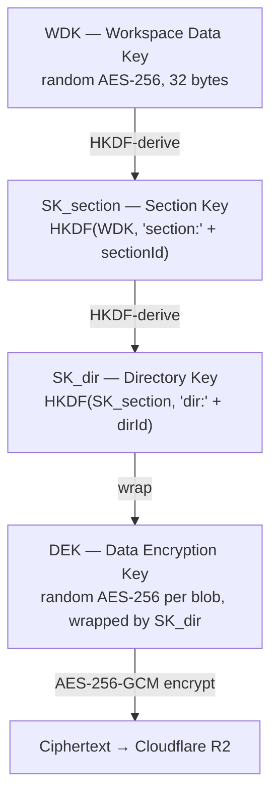

## What it is

A K-Perception **Workspace** is a shared, fully end-to-end encrypted environment for teams. Every document, file, channel message, calendar event, and Gantt task stored inside a workspace is encrypted on your device before it reaches the server. The Cloudflare infrastructure — including the database (D1) and object storage (R2) — stores only ciphertext. No server-side process, Cloudflare worker, or database query can read the content of your workspace data.

Workspaces are distinct from your personal vault. Your personal vault is a single-user encrypted note store. A workspace extends the same zero-knowledge model to a group of people who collaborate in real time, with shared key material distributed safely to each device that is authorised to participate.

A workspace has a single root secret called the **Workspace Data Key (WDK)**. Every other key in the workspace is derived from, or wrapped by, the WDK. Distributing access to a workspace means distributing a wrapped copy of the WDK to each member. Revoking access means deleting that wrapped copy from D1 — the member instantly loses the ability to derive any key in the workspace.

## When to use it

Use a workspace whenever two or more people need to collaborate on the same encrypted knowledge base. Typical use cases include:

- Engineering teams documenting architecture and sharing code-linked notes
- Legal or compliance teams sharing sensitive documents with controlled access
- Research groups maintaining a shared citation library and writing collaboratively
- Remote companies that need channels, file sharing, and project timelines — all without trusting the server with plaintext

If you are working alone, your personal vault is the correct choice. Workspaces carry a per-seat billing cost and are designed for multi-user scenarios.

## Step by step

### Creating your first workspace

1. Open K-Perception on any supported platform (Windows, Android, or Web).
2. Tap or click the **Workspaces** icon in the left navigation bar.
3. If your current plan is below Team tier, you will be prompted to upgrade. Workspaces require at minimum a **Team** plan (€6.99/user/month).
4. Click **New Workspace**, enter a name and optional description, and confirm.
5. K-Perception generates a random 32-byte AES-256 WDK on your device, wraps it with your device key, and sends only the ciphertext to the server.
6. Default sections are provisioned automatically. A dedicated `files-{wsId.slice(0,8)}` section for workspace file storage is also auto-provisioned.
7. You land in the **WorkspaceShell** — the three-pane workspace interface.

### Navigating the WorkspaceShell

The WorkspaceShell has three panes:

- **Left sidebar**: workspace selector, section list, channel list, member presence strip, and navigation links to Calendar, Gantt, Citations, and Admin.
- **Content pane**: the active surface — a channel feed, a document editor, a file browser, etc.
- **Detail pane** (right, collapsible): context-sensitive details — file metadata, member profile, message thread, etc.

## Key concepts

### Members

Every person who can decrypt workspace content is a **member**. Members have a role (Owner, Admin, Member, or Guest) and hold a wrapped copy of the WDK on their device. Adding a member means the Owner or Admin wraps the WDK with the new member's device key. Removing a member means deleting their wrapped WDK from D1.

### Sections

A section is a logical partition of the workspace with its own HKDF-derived key (`SK_section`). Sections allow you to grant access to a subset of workspace content without exposing the rest. All documents and files in a section are encrypted under keys derived from `SK_section`.

### Channels

Channels are E2EE text rooms within a workspace. Each channel has a per-channel key derived from its section's key. Messages are AES-256-GCM encrypted per message. Channels also support threads, pinned messages, voice messages, and a real-time relay via a per-channel Durable Object.

### Files

The workspace file system is a hierarchical directory tree. Files are encrypted with a per-blob Data Encryption Key (DEK) that is itself wrapped with the directory key (`SK_dir`), which is derived from the section key. This creates a four-level key chain: WDK → SK_section → SK_dir → DEK → ciphertext.

### Groups

A group is a named set of members that maps to a section key (`SK_group ≡ SK_section`). Adding a user to a group grants them access to everything encrypted under that section key. Groups are the primary mechanism for managing access at scale.

## The WDK key hierarchy



Each workspace member holds a copy of the WDK encrypted with their own device key:

```
member_wdk_wrap = AES-KW(device_key, WDK)
```

This copy is stored in D1 against the member's `user_id`. When the member authenticates and unlocks their device key, they decrypt their wrapped WDK copy to obtain the plaintext WDK in memory. From there, all section keys, directory keys, and DEK unwrapping operations happen client-side.

## How workspace data is isolated cryptographically

The server never holds a plaintext WDK. It stores:

1. The ciphertext blobs in R2 (encrypted with per-file DEKs).
2. Encrypted metadata in D1 (titles, filenames, and other fields are name-encrypted with the relevant section key).
3. Wrapped WDK copies for each member (but not the device keys needed to unwrap them).
4. Wrapped DEK copies per blob (but not the SK_dir needed to unwrap them).

Even if the entire Cloudflare D1 database and R2 bucket were exfiltrated, an attacker could not read any workspace content without at least one member's device key.

## Platform differences

- **Windows desktop**: Full WorkspaceShell with three-pane layout, rich-text editor, file drag-and-drop.
- **Android**: Dedicated mobile surfaces per feature (MobileFilesSurface, MobileCalendarSurface, etc.). The three-pane layout collapses to a stack-navigation model.
- **Web**: Same functionality as desktop, delivered in the browser. IPC bridge is not used; all crypto runs in the browser's Web Crypto API.

## Plan availability

| Plan | Workspaces |
|------|-----------|
| Local (€0) | Not available |
| Guardian (€3.49/mo) | Not available |
| Vault (€7.99/mo) | Not available |
| Lifetime (€149) | Not available |
| **Team (€6.99/user/mo)** | **Available** |
| **Enterprise (€14.99/user/mo)** | **Available** |

## Permissions and roles

| Action | owner | admin | editor | guest |
|--------|-------|-------|--------|-------|
| Create workspace | — | — | — | — |
| Invite members | Yes | Yes | No | No |
| Manage sections | Yes | Yes | No | No |
| View audit log | Yes | Yes | No | No |
| Rotate workspace key | Yes | Yes* | No | No |
| Delete workspace | Yes | No | No | No |

*Requires TOTP elevation token for all dangerous operations.

## Security implications

- The WDK is generated on your device and never leaves it in plaintext.
- Removing a member from a workspace removes their wrapped WDK; they cannot re-derive any section, directory, or file key.
- All dangerous operations (key rotation, workspace deletion, remote wipe, ownership transfer) require a TOTP step-up elevation token that is validated server-side.
- Workspace metadata (names of documents, filenames) is encrypted with the section key; the server cannot read them.

## Settings reference

| Setting | Where | Notes |
|---------|-------|-------|
| Workspace name | Admin → Settings | Encrypted at rest |
| Workspace description | Admin → Settings | Encrypted at rest |
| Invite policy | Admin → Settings | Open, invite-only, or quorum |
| Auto-backup schedule | Admin → Backups | Cron expression |
| IP allowlist | Admin → Security | Enterprise only |

## Related articles

- [Creating a workspace](workspaces/creating-a-workspace)
- [Sections](workspaces/sections)
- [Channels](workspaces/channels)
- [Files and directories](workspaces/files-and-directories)
- [File versioning](workspaces/file-versioning)
- [Per-file ACL](workspaces/per-file-acl)
- [Shared with me](workspaces/shared-with-me)
- [Calendar](workspaces/calendar)
- [Gantt chart](workspaces/gantt)
- [Citations](workspaces/citations)
- [Presence](workspaces/presence)
- [Members and roles](workspaces/members-and-roles)
- [Groups](workspaces/groups)
- [Invitations](workspaces/invitations)
- [Webhooks](workspaces/webhooks)
- [API keys](workspaces/api-keys)
- [Admin console](workspaces/admin-console)
- [Backup and restore](workspaces/backup-restore)
- [Transfer ownership](workspaces/transfer-ownership)

## Source references

- `private-sync-worker/src/workspaces.ts` — workspace HTTP routes
- `src/shared/workspaceKeyManager.ts` — key hierarchy implementation
- `src/shared/wdkCrypto.ts` — WDK wrap/unwrap operations
- `src/shared/workspaceClient.ts` — client-side workspace API
- `private-sync-worker/migrations/0008_team.sql` — initial team workspace schema
- `private-sync-worker/migrations/0011_workspace_full.sql` — full workspace schema
